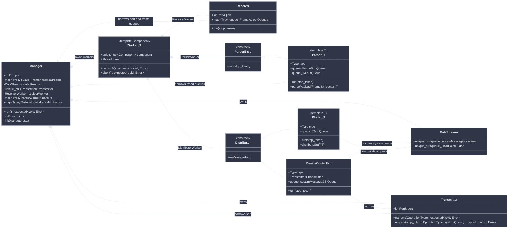
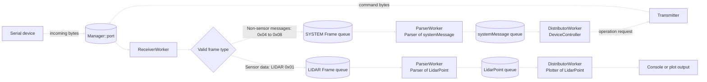
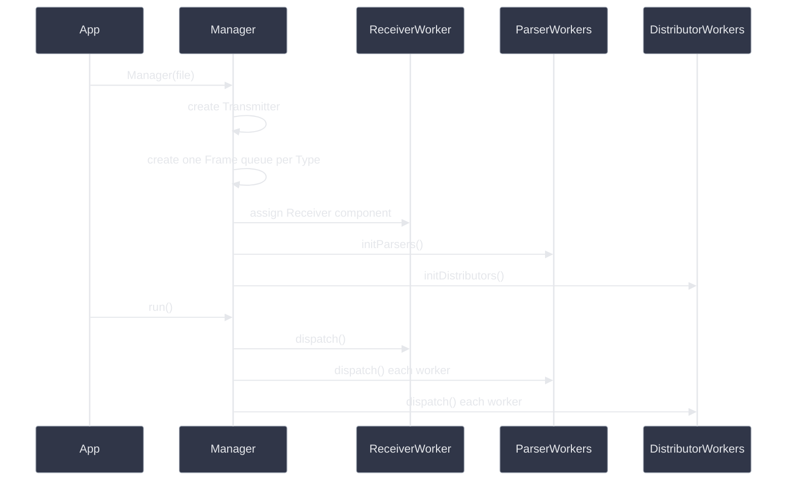

# Architecture

This document describes the current implementation, including ownership, worker lifecycle, and data flow.

## Class Diagram



`Worker<Component, InitError>` owns one runnable component and its `std::jthread`. Every runnable component exposes `run(std::stop_token)`, allowing the worker to start any component without component-specific dispatch logic. `InitError` selects the error returned if the component is missing.

```cpp
using ReceiverWorker    = Worker<receiver::Receiver, Error::RECEIVER_INIT_FAILED>;
using ParserWorker      = Worker<parser::ParserBase, Error::PARSER_INIT_FAILED>;
using DistributorWorker = Worker<distributor::Distributor, Error::DISTRIBUTOR_INIT_FAILED>;
```

## Data Flow



The intended routing sends valid sensor data to its sensor-specific Frame queue and all non-sensor messages to the SYSTEM Frame queue. The currently defined non-sensor wire types are INITIALIZING (`0x04`), DEVICE_INFO (`0x05`), HEALTH_STATUS (`0x06`), READY (`0x07`), and STARTUP_FAILED (`0x08`). LIDAR (`0x01`) is the only sensor path with a queue and parser today; IMU (`0x02`) and Encoder (`0x03`) would need their own sensor paths when supported.

The SYSTEM routing shown above is not implemented yet. `Receiver` currently uses the wire type directly as the `frameStreams` key, so types `0x04` through `0x08` create queues without a parser instead of reaching the SYSTEM queue. This remains part of [issue #1](https://github.com/kei185/my-plot/issues/1).

`Manager` owns one `io::Port`. `Receiver` reads incoming bytes from its POSIX file descriptor, while `Transmitter` writes commands through the same port.

## Initialization and Execution



`initParsers()` and `initDistributors()` construct components and assign them to workers. Threads are started later by `Manager::run()` through `Worker::dispatch()`.

## Shutdown

`Worker::abort()` requests cancellation through the worker's `std::jthread`. The `jthread` destructor subsequently joins the thread. Every component must check its `std::stop_token` regularly and return after cancellation is requested.

## Current Limitations

- The queues are accessed from multiple threads, but `std::queue` is not thread-safe. A synchronized queue abstraction is still required.
- Empty queues are polled continuously, creating busy-wait loops. A condition variable or blocking queue would avoid unnecessary CPU use.
- `frameStreams` and the queues inside `DataStreams` are heap-allocated even though `Manager` has sole ownership. They could be stored directly unless stable indirection is required.
- Initialization is listed explicitly for every frame type. This is verbose, but keeps the mapping between frame type, parsed data type, and distributor visible.
