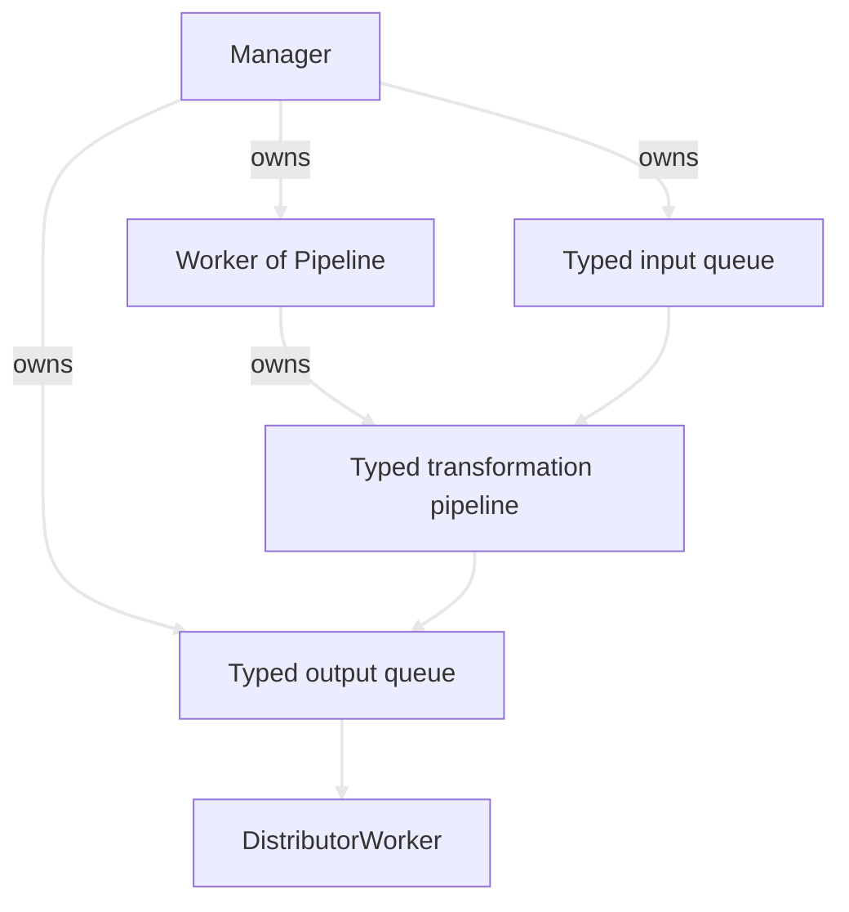

# Typed Transformation Pipelines

## Motivation

The data path can be modeled as a sequence of typed transformations:

```text
Stream<A> -> Stage<A, B> -> Stream<B> -> Stage<B, C> -> Stream<C>
```

For example, a LIDAR path may evolve into the following pipeline:


The transformation model is independent of the object that owns its queues and workers. In the current architecture, `Manager` owns those resources; a pipeline would only describe the ordered transformations.

```text
Manager  = routing, queues, execution, and lifetime
Pipeline = an ordered sequence of transformations
Stage    = one typed transformation
```

## Stages as Function Objects

Each stage is represented by a function object. The stage declares its input and output types and implements `operator()`:

```cpp
struct LidarParser
{
    using Input  = frame::Frame;
    using Output = LidarRaw;

    Output operator()(const Input& input) const;
};

struct CoordinateConverter
{
    using Input  = LidarRaw;
    using Output = CartesianPoint;

    Output operator()(const Input& input) const;
};
```

An object with `operator()` can be invoked like a function:

```cpp
LidarParser parser;
CoordinateConverter converter;

LidarRaw raw          = parser(frame);
CartesianPoint point  = converter(raw);
```

This is equivalent to calling `parser.operator()(frame)`, but the function-call syntax gives every stage a uniform interface:

```cpp
auto output = stage(input);
```

Without this convention, different stages may expose unrelated method names such as `parse`, `convert`, and `apply`. A uniform call expression allows generic pipeline code to invoke all stages without knowing their concrete responsibilities.

Function objects may also contain configuration or state:

```cpp
struct NoiseFilter
{
    using Input  = CartesianPoint;
    using Output = CartesianPoint;

    double threshold;

    Output operator()(const Input& point) const
    {
        return filterPoint(point, threshold);
    }
};
```

## Compile-Time Pipeline Composition

When the stage sequence is selected at build time, heterogeneous stages can be stored in a `std::tuple`:

```cpp
auto stages = std::tuple{
    LidarParser{},
    CoordinateConverter{},
    NoiseFilter{.threshold = 0.5},
};
```

The pipeline applies each stage to the result of the previous stage:

```cpp
template <std::size_t Index = 0, typename Stages, typename Value>
decltype(auto) runPipeline(Stages& stages, Value&& value)
{
    if constexpr (Index == std::tuple_size_v<Stages>) {
        return std::forward<Value>(value);
    } else {
        auto next = std::get<Index>(stages)(
            std::forward<Value>(value));

        return runPipeline<Index + 1>(
            stages,
            std::move(next));
    }
}
```

Conceptually, the nested calls are equivalent to:

```cpp
auto result = filter(converter(parser(frame)));
```

The stage list is variable in length from one pipeline type to another, but its length is fixed after compilation. This preserves static type checking and avoids runtime type erasure.

## Validating Adjacent Types

For two adjacent stages to connect, the output of the first stage must be accepted as the input of the second stage:

```cpp
template <typename First, typename Second>
concept Connectable = std::same_as<
    typename First::Output,
    typename Second::Input>;
```

For example:

```cpp
static_assert(Connectable<LidarParser, CoordinateConverter>);
```

A complete `Pipeline<Stages...>` implementation can apply this check to every adjacent pair. An invalid connection then fails during compilation instead of becoming a runtime error.

## Single-Threaded and Concurrent Pipelines

There are two distinct execution models.

### One worker for the complete pipeline

One worker reads an item from the channel input, applies all transformations immediately, and publishes the final result:

```text
Input queue -> [Stage 1 -> Stage 2 -> Stage 3] -> Output queue
```

Advantages:

- No intermediate queues are required.
- No synchronization is required between stages.
- The implementation is compact and type-safe.
- End-to-end latency is usually low.

This model is appropriate when the stages are lightweight and do not need independent scheduling.

### One worker per stage

Every stage owns or borrows an input stream and an output stream:

```text
Queue<A> -> Stage<A, B> -> Queue<B> -> Stage<B, C> -> Queue<C>
```

Advantages:

- Different stages can run concurrently.
- Slow stages can be isolated through buffering.
- Individual stages may use different scheduling or backpressure policies.

Costs:

- Every boundary requires a thread-safe queue.
- Shutdown and ownership are more complex.
- Buffer sizes and backpressure must be designed explicitly.
- More threads do not necessarily improve throughput on a small target.

The transformation itself can remain a function object in both models. In the concurrent model, a worker repeatedly removes one item from its input queue, calls the function object, and publishes the returned value to its output queue.

## Relationship to the Current Architecture

The current application does not use a `DataChannel` abstraction. Instead, `Manager` owns the typed queues and connects independently managed workers:

```text
Frame queue -> ParserWorker -> Data queue -> DistributorWorker
```

A future pipeline abstraction could replace a single parser when a data path requires several consecutive transformations:

```cpp
using LidarPipeline = Pipeline<
    LidarParser,
    CoordinateConverter,
    NoiseFilter>;
```

The pipeline would remain a component managed by `Worker<Pipeline, InitError>`:



This document describes an exploratory extension rather than the currently implemented architecture.

## Runtime-Configurable Pipelines

If stages must be inserted or removed while the program is running, `std::tuple` is not sufficient because every `Stage<A, B>` has a different type. Runtime composition requires type erasure, commonly through a base class and a closed message variant:

```cpp
using Message = std::variant<
    frame::Frame,
    LidarRaw,
    CartesianPoint,
    FilteredPoint>;

struct StageBase
{
    virtual Message process(Message input) = 0;
    virtual ~StageBase() = default;
};

std::vector<std::unique_ptr<StageBase>> stages;
```

This approach permits runtime reconfiguration, but it moves connection validation to runtime and introduces visitation and allocation overhead. For an embedded system with a known set of data paths, compile-time composition is generally the simpler starting point.

## Recommended Direction

Use compile-time pipelines unless runtime reconfiguration is an explicit requirement:

1. Represent each transformation as a small function object with `Input`, `Output`, and `operator()`.
2. Store the ordered stage objects in a `std::tuple`.
3. Validate every adjacent input/output pair at compile time.
4. Let `Manager` own the external queues and let `Worker<Pipeline, InitError>` own pipeline execution.
5. Begin with one worker per complete pipeline; introduce intermediate queues only when measurement shows that independent stage execution is useful.

This design keeps routing, transformation, and execution as separate concerns while preserving static type safety.
